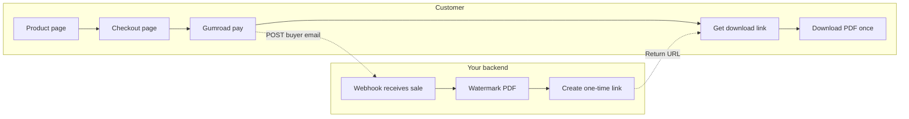
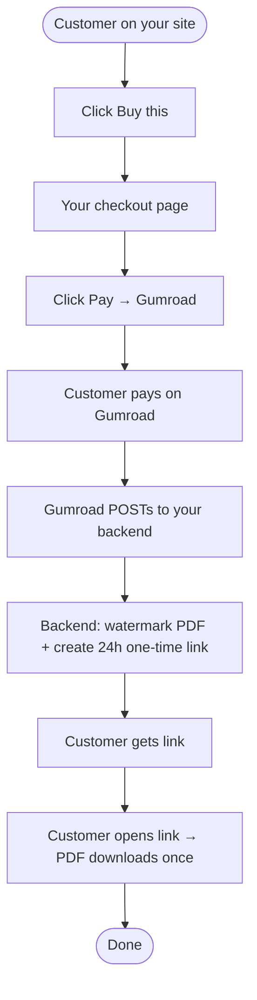

# Buy PDF – concise workflow

## Short flow (5 steps)

1. **Customer** visits your site → clicks **Buy this**
2. **Checkout page** → customer clicks **Pay** → goes to **Gumroad**
3. **Customer pays** on Gumroad → Gumroad sends **webhook** to your backend (buyer email + name)
4. **Backend** creates watermarked PDF + **one-time 24h link** → returns link (e.g. for thank-you page or email)
5. **Customer** opens link → **downloads PDF once** → link expires

---

## Flowchart

---

## Same flow (top to bottom)

---

## One-line summary

**Customer → Buy this → Pay on Gumroad → Backend gets webhook → Watermarked PDF + one-time link → Customer downloads once.**
